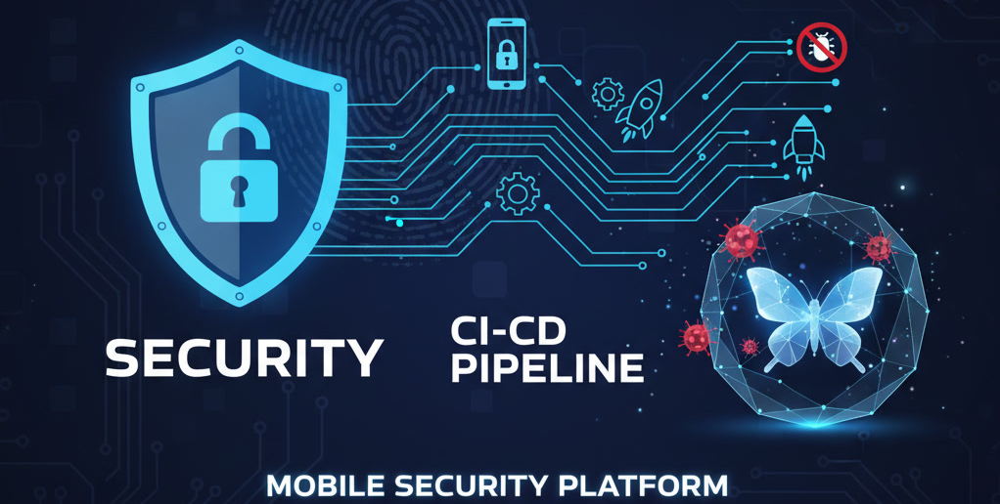

<h1 align="center">🔐 Flutter Secure Pipeline</h1>

<p align="center">
  <i>Pipeline completa de CI/CD Seguro para Apps Flutter (Android), alinhada a MASVS, OWASP Mobile e Supply Chain Security.</i><br/>
  <i>Qualidade · Segurança · Automação · Integridade · Confiabilidade</i>
</p>

---

# ⚡ Resumo Executivo

- 🛡 **30+ validações automáticas de segurança** para apps Flutter (Android)  
- 📦 Cobertura de **SAST, DAST, SCA, Binary Scan e Supply Chain Security**  
- 📘 Alinhado aos padrões **MASVS**, **OWASP Mobile Top 10** e **SLSA**  
- 🔑 Assinatura OIDC (Keyless) + SBOM (CycloneDX) + Provenance assinada  
- 🧪 Governança de Engenharia com: **melos analyze**, **format:check**, **tests**, **coverage**, **Semgrep**, **CodeQL**  
- 📱 App alvo real (**FlutterBank**), modular e arquitetado  
- 🔍 Foco total em open-source + segurança mobile enterprise  

---

# 🏅 Badges Profissionais

<p align="center">

<!-- Core Tech -->


<!-- CI/CD -->


<!-- Code Quality -->


<!-- Security -->


<!-- Supply Chain -->


<!-- Standards -->


</p>

---

# 🎯 Objetivo

Este repositório é um laboratório que demonstra uma **pipeline de Segurança Mobile para Flutter (Android)**, construída **100% com ferramentas open-source** e estruturada como referência para evolução de segurança de aplicativos que exigem maior rigor no controle de vulnerabilidades.

O objetivo principal é demonstrar como iniciar e testar um pipeline de **CI/CD Mobile** utilizando exclusivamente ferramentas **Open Source**. Aqui, o foco não é apenas "rodar testes", mas orquestrar uma defesa focado em segurança mobile android com flutter.

Para validar este pipeline em um cenário realista, foi desenvolvido o **FlutterBank**, um aplicativo de exemplo, simples mas modular, que serve como "Target" (alvo) para as validações de segurança e arquitetura.

O pipeline cobre **todo o ciclo de vida mobile**:  
**Qualidade → Build → Segurança → Supply Chain → DAST → Deploy**.

---

# 🧱 Governança de Engenharia (Qualidade + Padronização)

A pipeline implementa controles que garantem qualidade consistente:

### ✔ **Formatação e Estilo**
- `melos run format:check`  
- Regras obrigatórias para PRs  
- Fail-fast → PR bloqueado em caso de inconsistência  

### ✔ **Análise Estática Dart & Flutter**
- `melos run analyze`  
- Inclui validações recomendadas por OWASP/MASVS

### ✔ **Testes Unitários + Cobertura**
- `melos run test`  
- Combinação automática de todos os `lcov.info` do monorepo  
- Geração de relatório HTML  
- Upload como artefato do PR  

### ✔ **Gates para Build**
- PR só passa se:
  - Code format OK  
  - Analyze OK  
  - Tests OK  
  - Coverage gerado  
  - Dependências validadas  

---

# 🛡 Segurança Automática (SAST · SCA · Secrets · Binary Scan)

### 🔐 **Secret Scanning**
- Detect-Secrets 
- Gitleaks 
- Binary Scan (APK/AAB) → detecta chaves no binário

### 🔍 **SAST (Análise Estática)**
- MobSFScan (MASVS ruleset)  
- Semgrep (Dart + Flutter security ruleset)  
- MobSF + regras customizadas 

### 📦 **SCA — Análise de Dependências**
- Trivy (HIGH/CRITICAL enforcement)  
- OSV.dev Scanner 
- Dependabot enforcement 

### CodeQL para Kotlin/Java (MSTG-PLATFORM)

---

# 🔗 Supply Chain Security (SLSA · Cosign · SBOM)

### ✔ Assinatura OIDC (Keyless) com Cosign  
Artefatos assinados:
- AAB  
- SBOM  
- Provenance  

### ✔ SBOM (CycloneDX)
Geração + assinatura automática.

### ✔ Provenance (SLSA-like)
Inclui:
- Commit  
- Builder  
- Timestamp  
- GitHub OIDC identity  
- Bundle de transparência  

### ✔ Enforcement
- Falha em SCA → pipeline bloqueada  
- Falha em assinatura → bloqueio  
- Falha em proveniência → bloqueio  

---

# 🧪 DAST Mobile 

### 🔥 **SSL Pinning Validation**
Executado automaticamente em:
- Emulador Android otimizado  
- Certificado MITM injetado em “system trusted”  

### ⚔ **Runtime Bypass Testing **
- Tentativa de bypass da detecção de root  

---

# 🛰 DAST API (OWASP ZAP)
- ZAP Full Scan (20+ validações)  

---

# 🚀 CD Android (Build + Security)

Durante o workflow de release:

### 🏗 Build
- Melos Bootstrap  
- Flutter AAB Release  
- Geração de universal APK (para DAST)

### 🔐 SAST Avançado por Decompilação
- bundletool → universal.apks  
- JADX extraction 
- Busca automática por vulnerabilidades  

### 🔒 Ofuscação
- Coleta de `mapping.txt`  
- Verificação de `minifyEnabled`  

### 📤 Artefatos
- AAB + signatures  
- SBOM + signatures  
- Provenance  
- Relatórios SAST/DAST  
- universal.apk  

---

# 📱 FlutterBank — App Alvo do Pipeline

O app demonstra:

- Arquitetura limpa (Clean Architecture)  
- Modularização via Melos  
- Riverpod  
- GoRouter  
- Command Pattern  
- Fluxo realista (PIX → envio)  
- Ideal para validar segurança mobile  


# 🗂 Estrutura do Projeto

```plaintext
/
├── .github/workflows/     # CI/CD completo
├── apps/appbank/          # app de exemplo (modular)
├── pix/                   # package melos de pix (foco do pipeline)
└── scripts/               # Scripts executados

```
<br>

<p align="center">
  
  
</p>

---

# ⭐ Destaques Especiais
  
- 🔐 **Pipeline com 30+ validações de segurança**
- 📊 **Relatórios automáticos** (MobSF, Semgrep, Trivy, ZAP, OSV.dev)
- ☁ **Proveniência SLSA** + assinatura **keyless** com Cosign
- 🧩 **SAST tradicional + SAST por decompilação** (bundletool → universal.apk → JADX)  
  + **DAST com MITM, Frida e Objection**
- 🛡 **Enforcement real** — PRs, builds e releases são bloqueados em caso de risco
- 📦 **Artefatos profissionais para auditoria** (SBOM, provenance, signatures, SAST/DAST reports)
- ⚙ **Automação completa do ciclo mobile** — CI + Security CI + Release + DAST


# 💡 Próximos Passos

- Inserir o SonarQube/SonarCloud
- Implementar pipeline para **deploy da Play Store** 

# 📄 Isenção de Responsabilidade

Este projeto é um estudo de caso educacional. Ele demonstra como ferramentas Open Source podem elevar a barra de segurança, mas a proteção de aplicações críticas (como bancos reais) exige camadas adicionais de proteção. Use este repositório como referência para estudos e implementação de DevSecOps.

🚧 Este laboratório está em evolução contínua

<div align="center"> <sub>Desenvolvido com 💙 e ☕ por Alexandre Sato</sub> </div>


